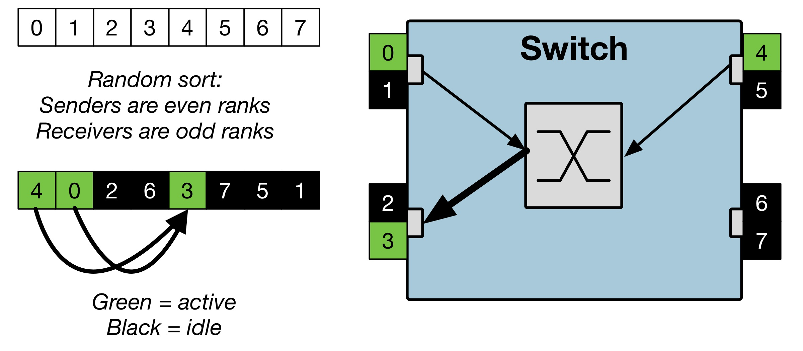

# Single Switch Validation Benchmark

#### Copyright (c) 2009-2018, Sandia National Laboratories
Sandia National Laboratories is a multimission laboratory managed and operated
by National Technology and Engineering Solutions of Sandia, LLC., a wholly 
owned subsidiary of Honeywell International, Inc., for the U.S. Department of 
Energy's National Nuclear Security Administration under contract DE-NA0003525.

---

## Introduction
This benchmark performs simultaneous point-to-point bandwidth tests using randomized sets of senders and receivers.
A range of buffer sizes is iterated over and multiple senders are allowed to send to a single receiver.
The intention is to generate a range of traffic patterns for the purposes of observing and analyzing network congestion.

## Building
The benchmark can be built with a standard MPI compiler or skeletonized with the SST compiler.
Edit the `CC` and `CXX`compilers as appropriate in the Makefile and run `make`.

## Running
After building, you can run the executable as
````
mpirun -n N ./runtraffic <num_senders> <num_recvers> <send_seed> <recv_seed>
````
which could be, for example:
````
mpirun -n 8 ./runtraffic 4 2 37 42
````
For a 24-port switch, a full traffic pattern injecting/ejecting on every port would be
````
mpirun -n 48 ./runtraffic 24 24 37 42
````
You must have `num_senders >= num_recvers`. Additionally, the total number of MPI ranks must obey `nproc >= 2*num_senders`.
Having more senders than receivers can create extra congestion at a single receiver. In the example above, there are 4 senders for 2 receivers. In general, it is best to always use `nproc = num_ports * 2` so that random scenarios are scattered across all possible ports on the switch, even if only a subset of the ports are active.

The seeds create a shuffle of the MPI ranks, causing different "intersection" patterns through the crossbar.
The benchmark requires that a send/receive pair do not reside on the same node to ensure that all measured bandwidths are from the switch, not the memory system. If send/recv random seeds cannot create a valid scenario, the benchmark will just exit.

The following figure demonstrates a 4-port switch experiment with 2 senders and 1 recver.


